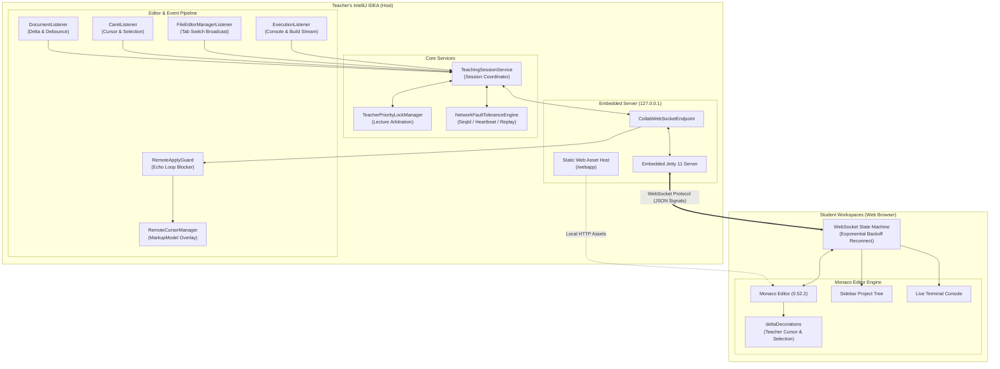

# EduPlus Collab - Real-Time Teacher-Student Collaborative Teaching Plugin

[](https://plugins.jetbrains.com/)
[](LICENSE)
[](https://kotlinlang.org/)
[](https://microsoft.github.io/monaco-editor/)

**EduPlus Collab** is an enterprise-grade, real-time interactive teaching and collaborative coding plugin built for **IntelliJ IDEA**. Designed specifically for computer science educators, programming bootcamps, and paired programming workshops, it seamlessly bridges the teacher's native IntelliJ IDEA IDE with zero-install, browser-based student workspaces powered by the Monaco Editor.

Unlike cloud-dependent collaboration suites, EduPlus Collab operates entirely on a **Local-Embedded Edge Architecture (Zero Cloud Dependency)**. It hosts an embedded HTTP/WebSocket server directly inside the teacher's IDE, enabling instant, high-performance collaboration over local area networks (LAN), computer lab subnets, and air-gapped classrooms.

---

## 🌟 Key Features

### 1. Zero Cloud Dependency & LAN-First Deployment
- **Embedded Jetty 11 Server**: Directly embedded into the teacher's IDE instance, hosting both the WebSocket synchronization hub and student web application.
- **Air-Gapped & Offline Ready**: Bundles all web assets—including Monaco Editor and syntax highlighters—locally. No internet connection, CDN requests, or external server configurations required.
- **Adaptive Port Probing**: Automatically detects port availability starting at port `9876`, dynamically resolving port conflicts without manual intervention.

### 2. Bidirectional Real-Time Code Synchronization
- **Sub-30ms Latency**: Ultra-responsive code synchronization powered by incremental delta packets (`code_delta`) and full-content state backups (`code_full`).
- **Interactive Collaboration by Default**: Both teacher and students can type, format, and interact simultaneously.
- **Teacher Priority Lock (TPL)**: An optional exclusive lecture mode that grants the teacher preemptive editing rights, preventing student concurrent input during critical demonstrations.
- **Echo-Loop Guard (`RemoteApplyGuard`)**: Three-tier reentrancy isolation (`ThreadLocal` + `UserData`) prevents remote updates from triggering cyclic event echo loops.

### 3. Non-Invasive Dual-Cursor & Selection Visualization
- **Teacher's Perspective (Blue)**:
  - High-visibility blue breathing cursor line.
  - Floating `👨‍🏫 Teacher` capsule badge positioned above the cursor.
  - Translucent blue selection background (`rgba(33, 150, 243, 0.25)`).
- **Students' Perspective (Orange)**:
  - Vibrant orange cursor indicators and selection overlays rendered directly in the teacher's editor via IntelliJ `MarkupModel`.
  - Floating student name tag badges (`👨‍🎓 Student`).
- **Co-Located Cursor Collision Fix**: Pure CSS floating badge positioning and dynamic caret offset compensation prevent cursor jumping back to the line start when teacher and student type at the exact same location.

### 4. Multi-Tab File Synchronization & Safe Tab Switching
- **Automatic Tab Following**: When the teacher switches active file tabs, the open file path, language syntax, and current document text are immediately pushed to connected students.
- **Crash-Free Tab Management**: Clean lifecycle teardown of `RangeHighlighter` handles prevent cross-editor `RangeHighlighterTree` EDT exceptions.
- **Monaco Layout Adaptation**: Automatic viewport coordinate reset prevents blank-screen issues caused by scrolling offset mismatches across different file lengths.

### 5. Project Workspace Tree Navigation
- **Live File Tree Explorer**: Displays the teacher's project file tree in the student's browser sidebar.
- **On-Demand File Opening**: Students can click files in the tree to request viewing them; the server safely retrieves the latest in-memory editor buffer or disk content.

### 6. Live Run Console Output Streaming
- **Comprehensive Terminal Forwarding**: Captures and streams standard output, error streams, compilation logs, and build errors in real time (`ProcessHandler` & `ExecutionListener`).
- **Build Failure Diagnostics**: Ensures pre-compile errors and javac diagnostics are clearly streamed to students so they can diagnose issues alongside the teacher.

### 7. Student Run Request with Teacher Confirmation
- **One-Click Student Execution**: Students can request running the current active code from the browser interface.
- **Teacher Confirmation Modal**: Displays an interactive confirmation dialog in IntelliJ IDEA with the requesting student's name, allowing the teacher to approve or decline execution safely.

### 8. Enterprise-Grade Fault Tolerance
- **Monotonic Sequence Ordering (`seqId`)**: Packet sequencing prevents out-of-order execution during network jitter.
- **Event Throttling & Debouncing**: 30ms throttling for cursor movements and 50ms debouncing for high-frequency keystrokes.
- **Heartbeat & Auto-Reconnection**: 3-second bidirectional ping/pong checks with exponential backoff reconnection and a 500-message sliding replay buffer.

### 9. 100% Unified English UI
- Teacher-facing ToolWindow panels, action menus, confirmation popups, legend cards, and student-facing browser interfaces are fully localized in standard English.

---

## 🏛️ System Architecture



---

## 📁 Project Directory Structure

```text
e:\eduplu\
├── build.gradle.kts                                    # Gradle build script (IntelliJ Platform Gradle Plugin 2.x)
├── settings.gradle.kts                                 # Project root settings
├── gradle.properties                                   # JVM options & IntelliJ SDK platform version
├── README.md                                           # Master documentation (English)
├── docs/                                               # Detailed technical whitepapers & specifications
│   ├── IDE_COLLABORATION_ENGINE_DESIGN.md              # IDE event listening & cursor rendering spec
│   ├── EMBEDDED_JETTY_AND_WEBSOCKET_ARCHITECTURE.md    # Embedded Jetty & WebSocket fault-tolerance architecture
│   ├── MONACO_COLLAB_ENGINE_SPEC.md                    # Monaco Editor client engine & rendering specification
│   └── PROJECT_DELIVERY_PLAN.md                        # Project delivery timeline, WBS & QA matrix
├── webapp/                                             # Student Web application static assets
│   ├── index.html                                      # Student single-page UI (English)
│   ├── style.css                                       # Dual-cursor styles, breathing animation & layout
│   └── app.js                                          # Monaco deltaDecorations, WS state machine & protocol handlers
├── src/main/resources/
│   ├── META-INF/
│   │   └── plugin.xml                                  # Plugin configuration, actions & extension points
│   └── webapp/                                         # Embedded web assets for standalone distribution
└── src/main/kotlin/com/eduplus/collab/
    ├── arbitration/
    │   └── TeacherPriorityLockManager.kt               # Sliding-window lecture priority arbitration
    ├── faulttolerance/
    │   ├── NetworkFaultToleranceEngine.kt               # Sequence ordering, throttling, debouncing & heartbeats
    │   └── ReplayBufferManager.kt                      # Sliding replay buffer & state recovery
    ├── protocol/
    │   └── ProtocolModels.kt                           # Unified JSON protocol models (10+ message types)
    ├── server/
    │   ├── EmbeddedJettyServer.kt                      # Embedded Jetty HTTP & WebSocket server
    │   ├── CollabWebSocketEndpoint.kt                  # WebSocket session routing & dispatch
    │   └── CollabProjectService.kt                     # IntelliJ ProjectService lifecycle management
    ├── render/
    │   ├── RemoteCursorRenderer.kt                     # Student orange cursor & name badge painter
    │   └── RemoteCursorManager.kt                      # MarkupModel RangeHighlighter lifecycle manager
    ├── editor/
    │   ├── RemoteApplyGuard.kt                         # Anti-recursion echo loop mutex guard
    │   └── CollabEditorStartupActivity.kt              # Editor listener binding startup activity
    ├── service/
    │   └── TeachingSessionService.kt                   # Central teaching session orchestrator
    ├── model/
    │   └── TeachingModels.kt                           # Domain models (TeachingMode, ConnectionStatus, etc.)
    └── ui/
        ├── TeachingControlPanel.kt                     # IntelliJ ToolWindow sidebar panel
        ├── TeachingToolWindowFactory.kt                # ToolWindow registration factory
        └── component/
            ├── StatusIndicatorComponent.kt             # Animated connection status indicator
            └── CursorLegendCard.kt                     # Dual-cursor visual legend card
```

---

## 📡 WebSocket Protocol Overview

All communication between the Teacher IDE and Student Web clients uses strongly-typed JSON frames over a persistent WebSocket connection:

| Signal Type | Sender | Purpose | Key Payload Fields |
|:---|:---|:---|:---|
| `code_full` | Teacher | Synchronizes full file content on open or tab switch | `filePath`, `language`, `content`, `version`, `seqId` |
| `code_delta` | Both | Sends incremental text edits (keystrokes / deletes) | `rangeOffset`, `oldLength`, `text`, `version`, `seqId` |
| `cursor_teacher` | Teacher | Broadcasts teacher's cursor coordinates & text selection | `line`, `ch`, `selectionStart`, `selectionEnd`, `filePath` |
| `cursor_student` | Student | Reports student's cursor coordinates & text selection | `studentId`, `studentName`, `line`, `ch`, `selection` |
| `heartbeat` | Both | Bidirectional liveness verification every 3 seconds | `clientTime`, `serverTime`, `role` |
| `project_tree` | Teacher | Sends the directory structure of the current workspace | `rootPath`, `tree` (nested nodes) |
| `open_file_request`| Student | Requests opening a specific workspace file | `filePath` |
| `console_output` | Teacher | Streams real-time run/compile console output to students | `text`, `outputType` (`stdout`/`stderr`), `timestamp` |
| `student_request_run`| Student | Asks the teacher to execute the current file | `studentId`, `studentName`, `filePath` |
| `run_status` | Teacher | Notifies students of execution approval/rejection | `status` (`approved`/`declined`), `message` |
| `reconnect_sync` | Student | Requests missed packet replay after network disconnection | `lastSeqId`, `clientVersion` |

---

## 🚀 Quick Start Guide

### Prerequisites
- **Operating System**: Windows, macOS, or Linux
- **Teacher IDE**: IntelliJ IDEA 2024.1 through 2026.x (Ultimate or Community Edition)
- **Java Development Kit**: JDK 17 or JDK 21
- **Student Browser**: Google Chrome, Microsoft Edge, Mozilla Firefox, or Safari (no installation required)

### Option 1: Running from Source
1. Clone or navigate to the repository directory:
   ```bash
   git clone https://github.com/josume1625-lgtm/eduplus-collab-plugin.git
   cd eduplus-collab-plugin
   ```
2. Launch the IntelliJ IDEA sandbox instance:
   ```bash
   ./gradlew runIde
   ```

### Option 2: Building the Distribution Package
1. Build the plugin ZIP package:
   ```bash
   ./gradlew buildPlugin
   ```
2. Locate the packaged artifact in `build/distributions/`:
   ```text
   build/distributions/eduplus-collab-plugin-1.0.0.zip
   ```
3. In your installed IntelliJ IDEA:
   - Go to **Settings / Preferences (`Ctrl+Alt+S` / `Cmd+,`) -> Plugins**.
   - Click the gear icon ⚙️ and select **"Install Plugin from Disk..."**.
   - Select `eduplus-collab-plugin-1.0.0.zip` and restart the IDE if prompted.

### Starting a Collaborative Session
1. Open any project in IntelliJ IDEA.
2. Locate the **"EduPlus Collab"** tool window tab on the right sidebar and click to expand the control panel.
3. Select your desired teaching mode:
   - **Interactive Mode (Default)**: Full two-way collaborative typing for paired programming and live Q&A.
   - **Teacher Exclusive Mode**: Strict lecture broadcast where student editing is locked.
4. Click **"Start Service"**.
5. Copy the generated local URL (e.g., `http://127.0.0.1:9876/?token=xxxx` or your local LAN IP `http://192.168.x.x:9876/?token=xxxx`) or click **"Open in Browser"**.
6. Share the link with students on the same local network. Students can immediately open the URL to view code, follow tabs, and collaborate!

---

## 🛠️ Teaching Modes

| Feature | Interactive Mode (Default) | Teacher Exclusive Mode |
|:---|:---:|:---:|
| Teacher Typing & Editing | ✅ Unrestricted | ✅ Unrestricted |
| Student Typing & Editing | ✅ Enabled (Bidirectional) | 🔒 Locked (Read-Only) |
| Dual Cursor Visualization | ✅ Active | ✅ Active |
| Tab Switch Synchronization | ✅ Automatic | ✅ Automatic |
| Console Stream Forwarding | ✅ Active | ✅ Active |
| Student Run Requests | ✅ Allowed (with Confirmation) | 🔒 Disabled |

---

## 📖 Technical Documentation

For in-depth architectural whitepapers, implementation details, and verification specifications, refer to the documents in [`docs/`](./docs/):
- **[IDE Event Listening & Remote Cursor Engine](./docs/IDE_COLLABORATION_ENGINE_DESIGN.md)**: Deep dive into `MarkupModel`, `RemoteApplyGuard`, and EDT safety.
- **[Embedded Jetty & WebSocket Fault Tolerance](./docs/EMBEDDED_JETTY_AND_WEBSOCKET_ARCHITECTURE.md)**: Protocol design, sequence ordering, and replay mechanisms.
- **[Monaco Editor Client Engine Specification](./docs/MONACO_COLLAB_ENGINE_SPEC.md)**: Frontend Monaco decorations, viewport following, and offline asset bundling.
- **[Project Delivery Plan & WBS](./docs/PROJECT_DELIVERY_PLAN.md)**: Complete development roadmap, milestones, and testing matrix.

---

## 📄 License

This project is licensed under the [Apache License 2.0](LICENSE).
