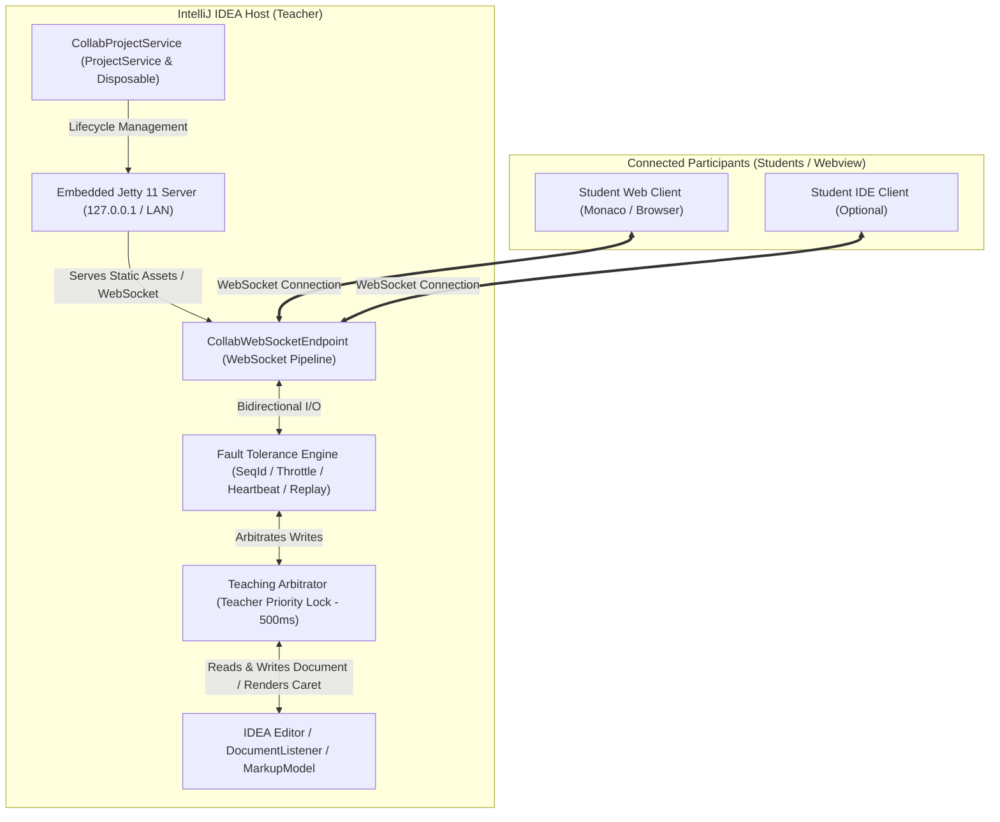
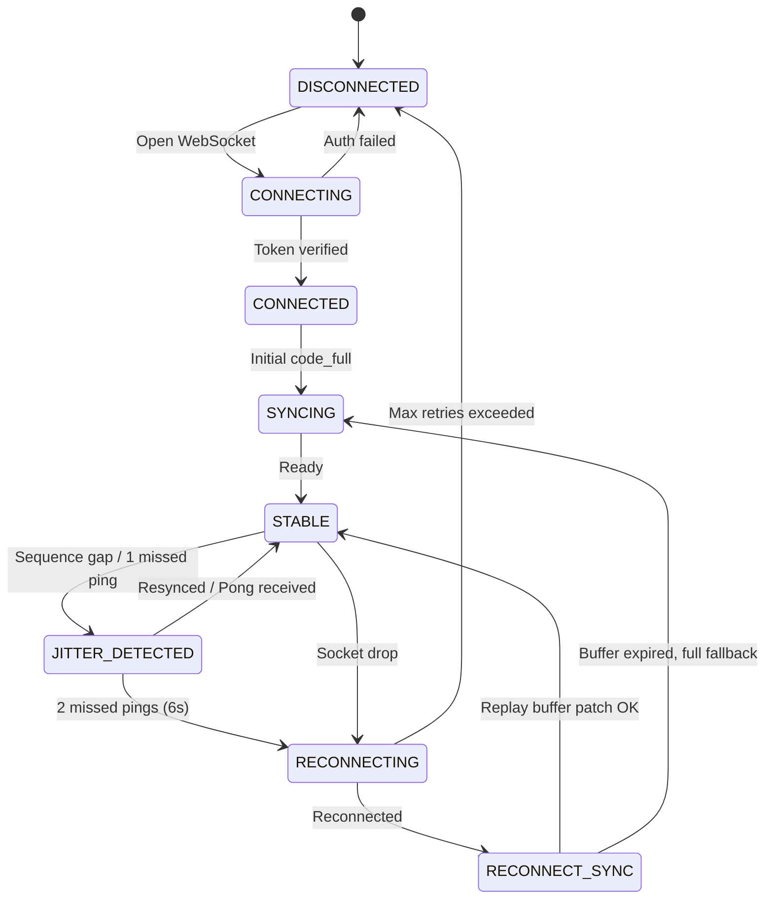
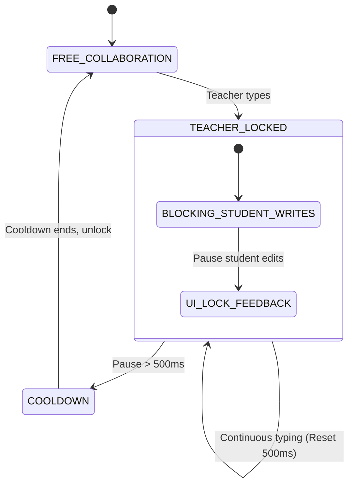

# IntelliJ IDEA Collaboration Plugin: Embedded Service, WebSocket Protocol & Fault-Tolerance Architecture Report

---

## 1. Overall Architecture & Blueprint

### 1.1 Plugin Positioning in Educational Scenarios
In real-time computer science education, the teacher's IntelliJ IDEA serves as the authoritative teaching center. Students connect to the teacher via web browsers (powered by Monaco Editor) or lightweight student IDE clients to observe code, collaborate incrementally, track cursors, and ask questions.

To eliminate dependencies on complex third-party cloud servers or external relays, the system adopts a **Local-Embedded Edge Architecture**: when the teacher starts a session, IntelliJ automatically initializes an embedded local server. Students connect directly through the local area network (LAN) or local loopback pipeline.

### 1.2 Architectural Layers & Data Flow
The system is cleanly divided into 5 logical layers:
1. **Transport Layer**: Powered by embedded Jetty 11, serving both HTTP static assets (student web application) and high-throughput bidirectional WebSocket channels.
2. **Security & Isolation Layer**: Enforces loopback and LAN binding, session token authentication, and origin verification to prevent unauthorized access, CSRF, and DNS rebinding attacks.
3. **Protocol & Session Layer**: Manages strongly-typed JSON protocols, multi-client sessions, and role permissions (`Teacher` vs. `Student`).
4. **Fault-Tolerance & Timing Engine**: Includes monotonically increasing sequence verification (`seqId`), reorder buffers, 30ms cursor throttling, 50ms keystroke debouncing, 3-second bidirectional heartbeats, sliding replay buffers, and full snapshot fallbacks.
5. **Teaching Arbitration Layer**: Implements the **Teacher Priority Lock (TPL)**, activating a 500ms sliding exclusive lock during teacher keystrokes to prevent concurrent student edits from interrupting lectures.



---

## 2. Embedded Jetty Server & Lifecycle Architecture

### 2.1 Technology Selection
Jetty 11 (with Jakarta WebSocket API support) is selected for the embedded server kernel:
- **Micro-Kernel & Lightweight**: Startup time < 120ms, memory overhead < 30MB, running smoothly within IntelliJ's platform runtime.
- **Unified Static & Dynamic Hosting**:
  - `ResourceHandler`: Serves pre-compiled student web assets (HTML5 / Monaco Editor / CSS / JS).
  - `WebSocketUpgradeHandler`: Handles thousands of concurrent JSON frames per second over persistent full-duplex TCP sockets.

### 2.2 Binding & Security Constraints
To ensure classroom workstations remain secure against remote code execution or internal network scanning:
1. **Configurable Interface Binding**:
   - Binds to `127.0.0.1` (loopback) or local network interface for classroom LAN sharing.
2. **Token-Based Handshake Authentication**:
   - Generates a high-entropy `AUTH_TOKEN` (UUID) upon session initialization.
   - Handshakes require `?token=xxx` query parameter or `X-EduPlu-Token` header. Unauthorized connections are rejected with `401 Unauthorized`.
3. **DNS Rebinding & CSRF Protection**:
   - Validates `Host` and `Origin` headers to prevent malicious browser-based rebinding attacks.

### 2.3 Port Conflict Detection & Adaptive Port Allocation
- **Default Port**: `9876`.
- **Probing & Adaptive Allocation**:
  Iteratively tests ports in range `[9876, 9896]`. If all candidate ports are busy, it falls back to dynamic system allocation (port `0`) and reports the assigned port back to the ToolWindow.
```kotlin
fun findAvailablePort(startPort: Int, maxAttempts: Int = 20): Int {
    for (port in startPort until (startPort + maxAttempts)) {
        try {
            ServerSocket().use { socket ->
                socket.reuseAddress = true
                socket.bind(InetSocketAddress("127.0.0.1", port))
                return port
            }
        } catch (_: IOException) {
            // Port occupied, check next
        }
    }
    // Dynamic system port fallback
    ServerSocket(0).use { socket ->
        return socket.localPort
    }
}
```

### 2.4 IntelliJ Service Lifecycle Management
- Registered as an IntelliJ `ProjectService` implementing `Disposable`.
- **Non-blocking Startup**: Starts Jetty on background threads via `AppExecutorUtil.getAppExecutorService()` to avoid freezing the Event Dispatch Thread (EDT).
- **Graceful Shutdown**:
  1. Broadcasts `SERVER_CLOSING` frame to all connected clients;
  2. Enforces a 1500ms graceful stop timeout;
  3. Stops and disposes Jetty connector handles;
  4. Flushes and cleans in-memory replay buffers and timer threads.

---

## 3. WebSocket Message Protocols

All messages use standard JSON envelopes containing message type, session ID, role, file path, sequence number, and timestamp:

### 3.1 Unified Envelope Format
```json
{
  "type": "code_delta",
  "sessionId": "sess-uuid-student-001",
  "role": "student",
  "filePath": "src/main/kotlin/Main.kt",
  "seqId": 1042,
  "timestamp": 1775558800123,
  "payload": { ... }
}
```

### 3.2 Protocol 1: `code_full` (Full Document Synchronization)
Sent upon student connection, active file/tab switch, or recovery from network disruption.
```json
{
  "type": "code_full",
  "sessionId": "sess-teacher-primary",
  "role": "teacher",
  "filePath": "src/main/kotlin/Demo.kt",
  "seqId": 101,
  "timestamp": 1775558800100,
  "payload": {
    "filePath": "src/main/kotlin/Demo.kt",
    "language": "kotlin",
    "content": "package com.demo\n\nfun main() {\n    println(\"Hello, Collaborative World!\")\n}\n",
    "version": 12,
    "totalLines": 5
  }
}
```

### 3.3 Protocol 2: `code_delta` (Incremental Text Mutation)
Carries character-level additions and deletions with sequence IDs and base versions.
```json
{
  "type": "code_delta",
  "sessionId": "sess-teacher-primary",
  "role": "teacher",
  "filePath": "src/main/kotlin/Demo.kt",
  "seqId": 102,
  "timestamp": 1775558800250,
  "payload": {
    "rangeOffset": 42,
    "oldLength": 5,
    "text": "println(\"Welcome Teacher\")",
    "version": 13,
    "baseVersion": 12,
    "seqId": 102
  }
}
```

### 3.4 Protocol 3: `cursor_teacher` (Teacher Cursor & Selection)
Synchronizes teacher cursor location and highlighted text range to student Monaco views.
```json
{
  "type": "cursor_teacher",
  "sessionId": "sess-teacher-primary",
  "role": "teacher",
  "filePath": "src/main/kotlin/Demo.kt",
  "seqId": 103,
  "timestamp": 1775558800310,
  "payload": {
    "line": 3,
    "ch": 14,
    "selectionStart": { "line": 3, "ch": 4 },
    "selectionEnd": { "line": 3, "ch": 28 },
    "teacherName": "Teacher",
    "avatarColor": "#2196F3"
  }
}
```

### 3.5 Protocol 4: `cursor_student` (Student Cursor & Selection)
Reports student cursor coordinates and active text selections back to the teacher IDE.
```json
{
  "type": "cursor_student",
  "sessionId": "sess-student-042",
  "role": "student",
  "filePath": "src/main/kotlin/Demo.kt",
  "seqId": 521,
  "timestamp": 1775558800320,
  "payload": {
    "studentId": "stu-9527",
    "studentName": "Student Alice",
    "line": 3,
    "ch": 18,
    "selectionStart": { "line": 3, "ch": 12 },
    "selectionEnd": { "line": 3, "ch": 20 },
    "cursorColor": "#FF9800"
  }
}
```

### 3.6 Protocol 5: `heartbeat` (Ping / Pong Liveness Check)
Measures round-trip time (RTT) and detects packet loss.
```json
{
  "type": "heartbeat",
  "sessionId": "sess-student-042",
  "role": "student",
  "seqId": 601,
  "timestamp": 1775558803000,
  "payload": {
    "action": "ping",
    "clientTime": 1775558803000,
    "serverTime": 0,
    "rttMs": 24
  }
}
```

### 3.7 Protocol 6: `reconnect_sync` (Reconnection Synchronization)
Client sends last known sequence ID and version upon reconnecting; server responds with either delta patches or a full snapshot.
```json
{
  "type": "reconnect_sync",
  "sessionId": "sess-student-042",
  "role": "student",
  "filePath": "src/main/kotlin/Demo.kt",
  "seqId": 602,
  "timestamp": 1775558812000,
  "payload": {
    "lastSeqId": 105,
    "clientVersion": 14,
    "filePath": "src/main/kotlin/Demo.kt"
  }
}
```

---

## 4. Network Fault Tolerance & Jitter Resilience Engine

### 4.1 Sequence Verification & Reorder Buffer
- Each transmission increments a 64-bit `seqId`.
- The receiver maintains `expectedSeqId`:
  - `msg.seqId == expectedSeqId`: Dispatched immediately; `expectedSeqId++`.
  - `msg.seqId < expectedSeqId`: Dropped silently as duplicate.
  - `msg.seqId > expectedSeqId`: Stored in a 64-entry `PriorityQueue` reorder window with a 150ms gap timeout before requesting resync.

### 4.2 Throttling & Keystroke Debouncing
- **30ms Cursor Throttling**: Bounds mouse and navigation updates to ~33 FPS. Ensures the final rest position is always delivered cleanly.
- **50ms Keystroke Debouncing**: Rapid adjacent keystrokes are batched in memory before sending, preventing packet floods.

### 4.3 3-Second Bidirectional Heartbeat
- Host sends ping frames every 3,000ms.
- Two consecutive missed heartbeats (6,000ms) marks the client as disconnected, freeing editor resources.

### 4.4 Circular Replay Buffer & Recovery
- Maintains the last 500 `code_delta` mutations in memory.
- If a reconnecting client's version is within the buffer window, the server replays missing deltas (`REPLAY_PATCH`).
- If the client's version is beyond the window, server falls back to full content overwrite (`FALLBACK_FULL`).

### 4.5 Degradation Under Extreme Network Jitter
When latency exceeds 800ms or packet loss exceeds 30%:
- **Priority 1**: `code_full` & `code_delta` (never dropped).
- **Priority 2**: `heartbeat` & `reconnect_sync`.
- **Priority 3**: `cursor_student` & `cursor_teacher` (intermediate cursor frames dropped to avoid visual stutter).

---

## 5. Teacher Priority Lock (TPL) Arbitration

### 5.1 Design Rationale
Unlike generic collaborative editors that merge concurrent changes symmetrically, educational coding is teacher-led. Student typing during demonstrations can derail code logic and disorient the class. The Teacher Priority Lock ensures seamless instruction with student interaction.

### 5.2 Operating Principles
1. **Sliding Exclusive Lock Window**:
   - Keystrokes by the teacher in IntelliJ immediately activate the lock for **500ms**.
   - Consecutive typing continuously resets the 500ms countdown.
2. **Student Write Interception**:
   - During the lock window, student `code_delta` mutations are held in a pending queue.
   - The student Monaco UI displays a non-intrusive status indicating the teacher is editing.
3. **Automatic Release**:
   - When the teacher pauses for >500ms, the system returns to Interactive Mode and processes pending student inputs.

---

## 6. Finite State Machines & Workflows

### 6.1 Connection & Fault FSM


### 6.2 Teacher Priority Lock FSM


---

## 7. Core Implementation Manifest

Implemented across the following components in `com.eduplus.collab`:
1. `protocol/ProtocolModels.kt`: JSON data models, envelopes, and message serializers.
2. `arbitration/TeacherPriorityLockManager.kt`: Preemptive 500ms sliding-window lock manager.
3. `faulttolerance/NetworkFaultToleranceEngine.kt`: Sequence numbering, 30ms throttling, 50ms debouncing, and heartbeats.
4. `faulttolerance/ReplayBufferManager.kt`: Ring buffer and state recovery.
5. `server/EmbeddedJettyServer.kt`: Jetty engine, port probing, and token authentication.
6. `server/CollabWebSocketEndpoint.kt`: WebSocket session routing and broadcast.
7. `server/CollabProjectService.kt`: IntelliJ lifecycle management and graceful shutdown.
