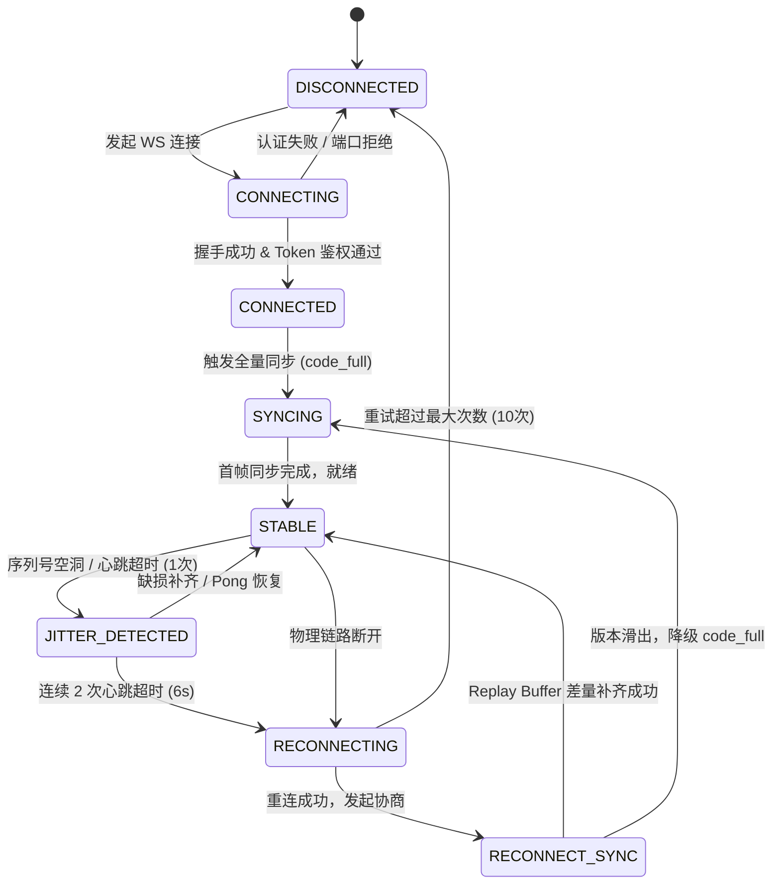
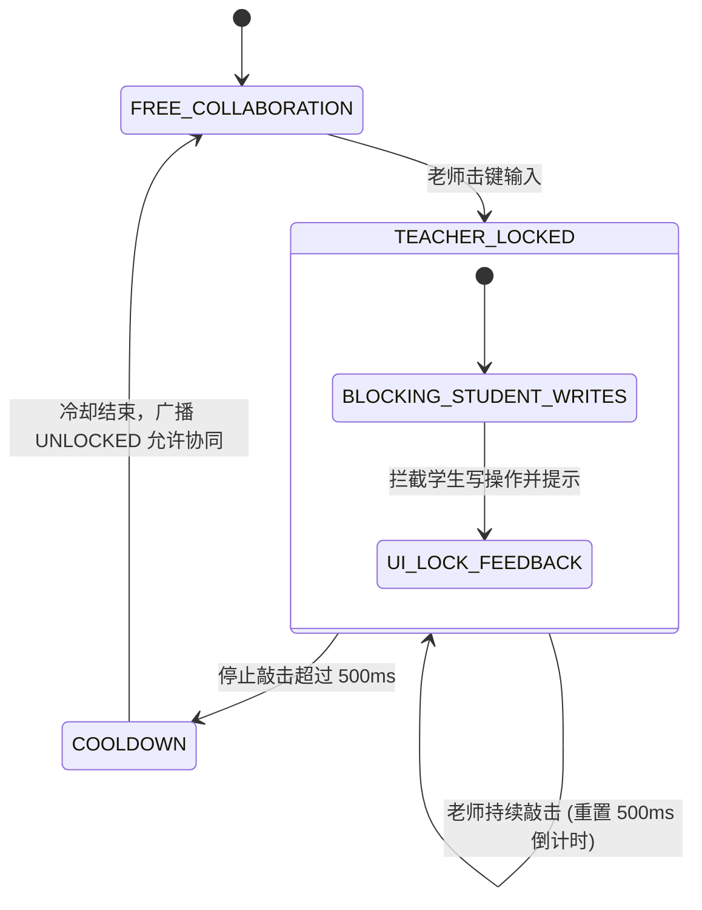
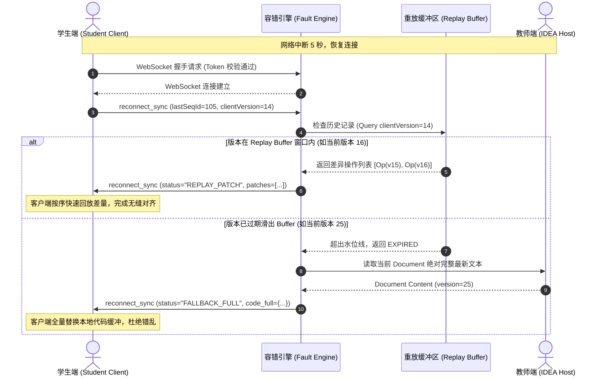

# IDEA 师生实时协同教学插件：本地嵌入式服务、WebSocket 协议与弱网容错引擎架构设计报告

---

## 1. 架构总体设计与组件全景 (Overall Architecture & Blueprint)

### 1.1 插件在教学场景下的定位
在师生实时协同教学场景中，教师端 IDEA 作为教学主控中心，学生端（可通过 Web 浏览器端或学生端轻量插件）连接到教师端进行实时代码查看、增量协同、光标追踪与提问互动。为避免对复杂外部公网云端服务器的强依赖，系统采用**本地去中心化/边缘嵌入式（Local-Embedded Edge Architecture）**架构：教师端 IDEA 启动时在本地自动拉起嵌入式服务，学生端直接通过内网/本地管道或穿透通道接入。

### 1.2 系统逻辑分层与数据流向
系统整体划分为 5 个清晰的核心层次：
1. **网络传输层 (Transport Layer)**：基于嵌入式 Jetty 11+ 实现，提供 HTTP 静态资源（前端 Webview 控制台）服务及高性能 WebSocket 双向传输通道。
2. **安全隔离层 (Security & Isolation Layer)**：严格实施 `127.0.0.1` 本地回环地址绑定，并基于握手 Token 认证与 Origin 白名单杜绝公网越权访问与 CSRF/DNS Rebinding 攻击。
3. **协议编解码与会话层 (Protocol & Session Layer)**：统一封装 6 大核心教学 WebSocket 协议，管理多端 Session 会话与角色权限（Teacher / Student）。
4. **网络容错与时序引擎 (Fault-Tolerance & Timing Engine)**：包含单调递增序列号校验（SeqId）、乱序重排缓冲区、30ms 光标节流（Throttle）、50ms 高频输入防抖（Debounce）、3 秒双向心跳探测、滑动重放缓冲区（Replay Buffer）与状态兜底机制。
5. **教学仲裁与冲突消解层 (Teaching Arbitration Layer)**：实现**老师优先锁机制 (Teacher Priority Lock, TPL)**，在教师敲击代码时激活 500ms 滑动独占锁，拦截/排队学生并发写操作，杜绝代码冲突与协同混乱。

```mermaid
flowchart TB
    subgraph IDE_Host ["IntelliJ IDEA 宿主环境 (Teacher / Host)"]
        direction TB
        ProjectService["CollabProjectService (ProjectService & Disposable)"]
        JettyServer["嵌入式 Jetty 11+ 服务器 (127.0.0.1)"]
        WSHandler["CollabWebSocketEndpoint (WebSocket 管道)"]
        FaultEngine["网络震荡与容错引擎 (SeqId / Throttle / Heartbeat / Replay)"]
        Arbitration["教学仲裁器 (Teacher Priority Lock - 500ms)"]
        EditorBridge["IDEA Editor / DocumentListener / MarkupModel"]
    end

    subgraph Clients ["协同参与方 (Students / Webview)"]
        StudentWeb["学生端 (Webview / Chrome Client)"]
        StudentPlugin["学生端 (IDEA Client 插件)"]
    end

    ProjectService -->|生命周期管理| JettyServer
    JettyServer -->|托管静态资源 / WebSocket| WSHandler
    WSHandler <-->|双向收发| FaultEngine
    FaultEngine <-->|写操作裁决| Arbitration
    Arbitration <-->|读写文档/标记光标| EditorBridge
    
    StudentWeb <==>|WS 连接 (127.0.0.1:Port)| WSHandler
    StudentPlugin <==>|WS 连接 (127.0.0.1:Port)| WSHandler
```

---

## 2. 本地嵌入式 Jetty 服务深度设计 (Embedded Jetty & Lifecycle Engine)

### 2.1 嵌入式 Jetty 架构与技术选型
选用 **Jetty 11+ (支持 Jakarta WebSocket API)** 作为底层服务内核，具备以下核心优势：
- **微内核轻量级**：启动耗时 < 120ms，内存开销 < 30MB，无缝嵌入 IntelliJ 平台沙箱内。
- **动静一体化托管**：
  - `ResourceHandler`：托管打包好的前端协同教学 Web 静态资源（HTML5/Monaco Editor/Vue）。
  - `WebSocketUpgradeHandler`：基于 `jakarta.websocket-api` 提供每秒万级并发帧的高吞吐全双工网络管道。

### 2.2 端口绑定与安全硬约束
为杜绝 IDE 插件被黑客用于远程代码执行（RCE）或内网渗透，系统施加以下**安全硬约束**：
1. **严格回环绑定 (Strict Loopback Binding)**：
   - ServerConnector 强制调用 `connector.setHost("127.0.0.1")`，**严禁使用 `0.0.0.0`**。
   - 彻底阻断来自局域网或公网非授权设备的直接 TCP 端口扫描与连接。
2. **基于 Session-Token 的握手鉴权**：
   - 每次服务启动生成一个高熵随机密钥 `AUTH_TOKEN` (UUID / SecureRandom)。
   - WebSocket 握手或 HTTP 请求必须携带 Query 参数 `?token=xxx` 或 Header `X-EduPlu-Token`，未授权连接在 HTTP 握手阶段立即返回 `401 Unauthorized` 并切断 TCP 链路。
3. **防止 DNS Rebinding 与 CSRF 劫持**：
   - 校验 HTTP 握手请求中的 `Host` 头（必须为 `127.0.0.1:<port>` 或 `localhost:<port>`）。
   - 检查 `Origin` 头，仅允许来自本地插件内部协议或预设信任白名单的请求。

### 2.3 端口冲突检测与自适应端口分配策略
- **默认端口**：设为 `9876`。
- **探测与自适应机制**：
  在绑定前通过 `ServerSocket(0)` 或针对指定端口的探测循环寻找可用端口。若 `9876` 被占用，则按 `[9876, 9877, ..., 9896]` 递增探测；若连续 20 个预留端口均被占用，则降级为由操作系统分配的动态端口（Port `0`），并通过内部回调将实际分配的端口通知 UI 工具窗口。
- **冲突重试算法**：
```kotlin
fun findAvailablePort(startPort: Int, maxAttempts: Int = 20): Int {
    for (port in startPort until (startPort + maxAttempts)) {
        try {
            ServerSocket().use { socket ->
                socket.reuseAddress = true
                socket.bind(InetSocketAddress("127.0.0.1", port))
                return port
            }
        } catch (_: IOException) {
            // 端口被占用，尝试下一个端口
        }
    }
    // 兜底策略：由系统动态分配一个未占用端口
    ServerSocket(0).use { socket ->
        return socket.localPort
    }
}
```

### 2.4 IntelliJ 服务生命周期管理 (ProjectService + Disposable)
- **生命周期绑定**：
  - 将服务注册为 IntelliJ 的 `ProjectService`（或通过 `project.getService(CollabServerManager::class.java)` 获取）。
  - 实现 `com.intellij.openapi.Disposable` 接口。
- **启动时序**：
  - 在项目打开后，通过非阻塞的后台线程池（`AppExecutorUtil.getAppExecutorService()`）异步拉起 Jetty，确保**绝不阻塞 IntelliJ EDT (UI 事件分发线程)**。
- **优雅关闭 (Graceful Shutdown)**：
  - 当项目关闭或 Disposable 析构时触发 `dispose()`：
    1. 向所有已连接的 WebSocket 客户端广播 `SERVER_CLOSING` 通知帧；
    2. 设置优雅超时（Graceful Stop Timeout 1500ms），切断现存连接；
    3. 调用 `jettyServer.stop()` 和 `jettyServer.destroy()` 释放端口与 Socket 句柄；
    4. 清空并关闭内存重放缓冲区与定时心跳线程。
  - 用户可在 IntelliJ ToolWindow 手动点击“启动/暂停协同”按钮，支持安全的按需启停。

---

## 3. 6 大 WebSocket 消息协议设计 (Unified Protocol Specification)

所有消息均采用严格统一的 JSON 格式传输。每个消息包均包含基础信封结构（Envelope），用于统一追踪角色、会话、时间戳与递增序列号。

### 3.1 统一信封格式 (Message Envelope)
```json
{
  "type": "code_delta",
  "sessionId": "sess-uuid-student-001",
  "role": "student",
  "filePath": "src/main/kotlin/Main.kt",
  "seqId": 1042,
  "timestamp": 1775558800123,
  "payload": { ... }
}
```
- `type` (String, Required): 消息类型标识符。
- `sessionId` (String, Required): 客户端唯一会话 ID。
- `role` (String, Required): 角色枚举，`teacher` 或 `student`。
- `filePath` (String, Optional): 当前协同聚焦的相对文件路径。
- `seqId` (Long, Required): 消息严格单调递增序列号（每条物理消息 +1）。
- `timestamp` (Long, Required): 客户端发出的 Unix 时间戳 (ms)。
- `payload` (Object, Required): 具体业务报文载荷。

---

### 3.2 协议一：`code_full`（全量代码同步）
**应用场景**：学生初次加入房间、切换活动文件、断网重连协商失败降级兜底时。
```json
{
  "type": "code_full",
  "sessionId": "sess-teacher-primary",
  "role": "teacher",
  "filePath": "src/main/kotlin/Demo.kt",
  "seqId": 101,
  "timestamp": 1775558800100,
  "payload": {
    "filePath": "src/main/kotlin/Demo.kt",
    "language": "kotlin",
    "content": "package com.demo\n\nfun main() {\n    println(\"Hello, Collaborative World!\")\n}\n",
    "version": 12,
    "totalLines": 5
  }
}
```
- `filePath`: 同步的目标文件路径。
- `language`: 语法高亮类型（如 `kotlin`, `java`, `python`）。
- `content`: 完整代码文本内容。
- `version`: 文档绝对基线版本号（每次完整同步或增量合并后更新）。
- `totalLines`: 总代码行数，用于前端轻量级渲染校验。

---

### 3.3 协议二：`code_delta`（增量代码修改）
**应用场景**：常规教学编写中的字符增删改，配合单调递增的序列号与基线版本号。
```json
{
  "type": "code_delta",
  "sessionId": "sess-teacher-primary",
  "role": "teacher",
  "filePath": "src/main/kotlin/Demo.kt",
  "seqId": 102,
  "timestamp": 1775558800250,
  "payload": {
    "rangeOffset": 42,
    "oldLength": 5,
    "text": "println(\"Welcome Teacher\")",
    "version": 13,
    "baseVersion": 12,
    "seqId": 102
  }
}
```
- `rangeOffset`: 被替换/插入的字符在文档中的起始绝对偏移量 (0-indexed)。
- `oldLength`: 被替换/删除的原字符长度（若为纯插入，则为 0）。
- `text`: 新插入的文本（若为纯删除，则为空字符串 `""`）。
- `version`: 应用本次增量后产生的新版本号。
- `baseVersion`: 本次修改所基于的父版本号。
- `seqId`: 本次变更的操作序列号。

---

### 3.4 协议三：`cursor_teacher`（老师光标与选区）
**应用场景**：实时同步老师在 IDEA 编辑器中的光标焦点位置与多行代码高亮选区。
```json
{
  "type": "cursor_teacher",
  "sessionId": "sess-teacher-primary",
  "role": "teacher",
  "filePath": "src/main/kotlin/Demo.kt",
  "seqId": 103,
  "timestamp": 1775558800310,
  "payload": {
    "line": 3,
    "ch": 14,
    "selectionStart": {
      "line": 3,
      "ch": 4
    },
    "selectionEnd": {
      "line": 3,
      "ch": 28
    },
    "teacherName": "Prof. Zhang",
    "avatarColor": "#FF5722"
  }
}
```
- `line`: 光标当前所在的行号 (0-indexed)。
- `ch`: 光标当前所在的列号 (0-indexed)。
- `selectionStart`: 选区起始点对象（含 `line`, `ch`）。
- `selectionEnd`: 选区结束点对象（含 `line`, `ch`；若无选区则与起始点重合）。
- `teacherName`: 老师标识名称。
- `avatarColor`: 老师专属高亮光标颜色（如活力橙）。

---

### 3.5 协议四：`cursor_student`（学生光标与选区）
**应用场景**：学生在协同模式下移动光标、圈选代码提问或标记疑问点。
```json
{
  "type": "cursor_student",
  "sessionId": "sess-student-042",
  "role": "student",
  "filePath": "src/main/kotlin/Demo.kt",
  "seqId": 521,
  "timestamp": 1775558800320,
  "payload": {
    "studentId": "stu-9527",
    "studentName": "李同学",
    "line": 3,
    "ch": 18,
    "selectionStart": {
      "line": 3,
      "ch": 12
    },
    "selectionEnd": {
      "line": 3,
      "ch": 20
    },
    "cursorColor": "#2196F3",
    "isQuestionActive": true
  }
}
```
- `studentId`: 学生唯一标识。
- `studentName`: 学生姓名。
- `line` & `ch`: 学生光标位置。
- `selectionStart` & `selectionEnd`: 选区范围。
- `cursorColor`: 依学生分配的彩色光标颜色。
- `isQuestionActive`: 是否处于“举手提问/代码圈选疑问”状态。

---

### 3.6 协议五：`heartbeat`（ping / pong 双向保活）
**应用场景**：高频探测弱网丢包、断线检测与客户端/服务端往返时延（RTT）估算。
```json
{
  "type": "heartbeat",
  "sessionId": "sess-student-042",
  "role": "student",
  "seqId": 601,
  "timestamp": 1775558803000,
  "payload": {
    "action": "ping",
    "clientTime": 1775558803000,
    "serverTime": 0,
    "rttMs": 24
  }
}
```
**回包 (Pong)**：
```json
{
  "type": "heartbeat",
  "sessionId": "sess-student-042",
  "role": "teacher",
  "seqId": 802,
  "timestamp": 1775558803015,
  "payload": {
    "action": "pong",
    "clientTime": 1775558803000,
    "serverTime": 1775558803015,
    "rttMs": 15
  }
}
```
- `action`: 保活指令，`ping` 或 `pong`。
- `clientTime`: 客户端发出 ping 时的客户端本地时间戳。
- `serverTime`: 服务端接收并应答 pong 时的服务端本地时间戳。
- `rttMs`: 上一次计算得到的双向往返时延（毫秒）。

---

### 3.7 协议六：`reconnect_sync`（断线重连协商）
**应用场景**：网络中断或震荡恢复后，客户端携带自身拥有的最新操作位点尝试快速补发，避免直接下载超大文件；若无法修补则服务端发起全量同步。
**客户端发送协商请求**：
```json
{
  "type": "reconnect_sync",
  "sessionId": "sess-student-042",
  "role": "student",
  "filePath": "src/main/kotlin/Demo.kt",
  "seqId": 602,
  "timestamp": 1775558812000,
  "payload": {
    "lastSeqId": 105,
    "clientVersion": 14,
    "filePath": "src/main/kotlin/Demo.kt"
  }
}
```
**服务端应答方案 A（在 Replay Buffer 窗口内，补发差量）**：
```json
{
  "type": "reconnect_sync",
  "sessionId": "sess-student-042",
  "role": "teacher",
  "seqId": 901,
  "timestamp": 1775558812050,
  "payload": {
    "status": "REPLAY_PATCH",
    "fromVersion": 14,
    "targetVersion": 17,
    "patches": [
      {
        "seqId": 106,
        "rangeOffset": 50,
        "oldLength": 0,
        "text": "val a = 1\n",
        "version": 15
      },
      {
        "seqId": 107,
        "rangeOffset": 60,
        "oldLength": 0,
        "text": "println(a)\n",
        "version": 16
      }
    ]
  }
}
```
**服务端应答方案 B（版本过旧已超出 Replay Buffer 水位线，降级全量）**：
```json
{
  "type": "reconnect_sync",
  "sessionId": "sess-student-042",
  "role": "teacher",
  "seqId": 902,
  "timestamp": 1775558812050,
  "payload": {
    "status": "FALLBACK_FULL",
    "reason": "CLIENT_TOO_OLD_OUT_OF_BUFFER",
    "fullSync": {
      "filePath": "src/main/kotlin/Demo.kt",
      "language": "kotlin",
      "content": "package com.demo\n\nfun main() {\n    val a = 1\n    println(a)\n}\n",
      "version": 17
    }
  }
}
```

---

## 4. 网络震荡与弱网容错引擎设计 (Network Jitter & Fault Tolerance Engine)

在校园网 Wi-Fi、跨子网或远程弱网环境下，网络延迟抖动（Jitter）、丢包（Packet Loss）与高频事件拥塞是实时协同的最核心破坏因素。本引擎通过五大支柱设计实现工业级容错。

### 4.1 消息序列号机制与乱序重排 (SeqId & Reorder Buffer)
- **单调递增性**：发送端的每一个有效业务帧与控制帧分配严格自增 64 位长整型序列号 `seqId`。
- **接收端状态追踪**：
  接收端维护 `expectedSeqId`。
  - 若收到的消息 `msg.seqId == expectedSeqId`：立即交付业务层处理，`expectedSeqId++`。
  - 若 `msg.seqId < expectedSeqId`：判定为网络重发帧或重复过时帧，**直接静默丢弃**。
  - 若 `msg.seqId > expectedSeqId`：判定为网络乱序或中间丢包，将该消息存入本地 `PriorityQueue` 暂存区（Reorder Window，容量 64）。
  - **空洞等待超时 (Gap Wait Timeout 150ms)**：若在 150ms 内期待的缺损包仍未到达，触发主动补包请求或在超时后跳过并触发 `reconnect_sync`。

### 4.2 高频事件节流 (Throttle) 与防抖 (Debounce)
- **30ms 光标移动节流 (Cursor Throttle)**：
  - 光标位移（`cursor_teacher` / `cursor_student`）在鼠标滑动或键盘连续按键时触发频率可达 100~200 Hz。
  - 采用**滑动前置+后置保证节流器 (Leading & Trailing Throttle)**，设定窗口阈值为 **30ms**（约 33 FPS，完全满足人眼视觉流畅度）。
  - 在 30ms 时间窗内，中间多余位移点直接覆盖压缩；当 30ms 窗口闭合时，**强制发送最后一个精确停止位点**，确保光标不会停留在中途错误位置。
- **50ms 高频输入防抖 (Text Delta Debounce)**：
  - 针对键盘打字输入的代码增量 `code_delta`，用户快速敲击键盘时（如打字速度 8~15 次/秒），单个按键逐字发送会导致网络小包风暴。
  - 采用 **50ms 聚合防抖窗口**：如果在 50ms 内连续发生紧邻的字符追加或修改，本地合并器（Delta Combiner）在内存中将其合并为单一批量 RangeEdit，显著降低网络吞吐压力与文本更新抖动。

### 4.3 3 秒双向心跳保活检测与掉线判定机制
- **定时调度**：独立的守护协程/调度线程每隔 **3000ms** 向所有连接发起一次携带时间戳的 `heartbeat (ping)`。
- **掉线判定准则**：
  - 每次收到客户端的 `pong` 时，更新该 Session 的 `lastActiveTime = System.currentTimeMillis()` 并重置失败计数。
  - 若连续 **2 次心跳周期（即 6000ms）** 仍未收到任何有效 `pong` 或业务响应：
    1. 立即标记该客户端为 `DISCONNECTED` 状态；
    2. 关闭物理底层 TCP Socket；
    3. UI 界面上将对应学生的光标图标变灰并提示离线；
    4. 保留其在服务端的协作锁与状态缓存 60 秒，等待其断线重连。

### 4.4 断网重连与操作缓存回放 (Replay Buffer)
- **环形重放缓冲区 (Circular Replay Buffer)**：
  - 教师端服务端常驻一个定长内存环形队列（容量如 500 个增量操作），记录最近发生的 `code_delta` 序列，维护当前最新版本 `currentVersion` 与最新序列号 `currentSeqId`。
- **重连协商仲裁**：
  - 客户端网络重连恢复后，首发 `reconnect_sync` 协议，上报其本地持有的 `lastSeqId` 与 `clientVersion`。
  - **判定规则**：
    - 若 `clientVersion == currentVersion`：完全同步，直接放行，进入实时通信模式。
    - 若 `clientVersion < currentVersion` 且该版本仍处于 Replay Buffer 的有效滑动窗口内：
      计算缺失补丁差集 `[clientVersion + 1, currentVersion]`，下发 `REPLAY_PATCH`，客户端快速重放对齐。
    - 若 `clientVersion` 过旧（已滑出 Replay Buffer 历史）或版本号错乱：
      下发 `FALLBACK_FULL` 状态，强制将服务端当前最新的完整文档 `code_full` 重新推送，客户端原子替换整个文本缓冲区。

### 4.5 极端弱网下的状态兜底与防抖动策略 (Fallback Strategy)
- **帧丢弃优先级策略**：
  在网络严重卡顿（RTT > 800ms 或丢包率 > 30%）时，系统自动切换至**优先级衰减路由模式**：
  - **第一优先级（绝对保障）**：`code_full` 与 `code_delta`（代码文本数据流，不可丢失，丢失必须重传/全量覆盖）。
  - **第二优先级（低频控制）**：`heartbeat` 与 `reconnect_sync`。
  - **第三优先级（主动丢弃）**：`cursor_student` 与 `cursor_teacher`。
  - 一旦检测到网络回压（Send Buffer 拥塞），直接**丢弃所有堆积的光标帧**，仅发送最新的当前光标位置，坚决避免学生端看到光标“瞬移、卡顿、疯狂重放”的闪烁错乱。

---

## 5. 教学冲突消解与老师优先原则 (Teacher Priority Lock, TPL)

### 5.1 教学业务痛点与设计理念
在传统多人协同编辑器（如 Google Docs、Figma）中，通常采用无主 Operational Transformation (OT) 或 CRDT (Conflict-free Replicated Data Types) 进行平等并发合并。
然而在**编程教学场景**中，这种平等合并具有致命缺陷：
- 老师正在为全班演示关键算法逻辑，若学生在同一行或临近代码区域并发敲入字符，会导致光标剧烈跳跃、代码逻辑被破坏、教学过程被粗暴打断。
- 教学场景是**以老师为主导（Teacher-Centric）**的单向传授与双向答疑模式。因此，系统必须确立：**老师绝对优先原则 (Teacher Priority Lock)**。

### 5.2 老师优先锁 (TPL) 机制工作原理
1. **独占写锁窗口 (Exclusive Write Lock Window)**：
   - 默认状态为 `FREE_COLLABORATION`（自由协同）。
   - 只要老师在 IDEA 编辑器中输入任意一个字符（或触发光标删除），系统立即激活 **老师独占写锁 (TEACHER_LOCKING)**，锁超时窗口设为 **500ms**。
   - 老师连续敲击键盘时，每一次敲击事件均通过原子操作**向后平滑刷新该 500ms 窗口**（Sliding Expiry）。
2. **学生并发写入拦截与排队策略 (Student Interception & Queuing)**：
   - 在写锁激活期间（老师正在连续键入），学生端发送的任何 `code_delta` 请求直接被服务端仲裁器拦截：
     - **轻量排队模式**：将学生输入暂存入学生端本地挂起队列（Pending Write Queue）；
     - **UI 视觉反馈**：学生端编辑器即时显示浅色半透明锁定蒙层，并在光标处显示悬浮轻提示：*“👨‍🏫 老师正在书写演示，您的编辑已暂停...”*。
3. **解锁与协同释放 (Cool-down & Release)**：
   - 当老师停止敲击并超过 500ms 后，锁计时器到期，系统状态安全回退至 `FREE_COLLABORATION`。
   - 挂起的学生端队列被允许向服务端提交变更，或直接恢复自由协同模式与选区提问，保证了老师授课过程绝对丝滑不受打扰。

---

## 6. 核心状态转移机与时序图 (FSM & Flow Diagrams)

### 6.1 连接与容错状态转移机 (Connection & Fault FSM)


### 6.2 老师优先锁状态转移机 (Teacher Priority Lock FSM)


### 6.3 断线重连与全量降级时序图 (Reconnection Sequence Diagram)


---

## 7. 生产级 Kotlin 核心源码落地架构

工程代码按照工业级分层架构组织，位于 `com.eduplu.collab` 包下：
1. `com.eduplu.collab.protocol`：
   - `ProtocolModels.kt`：全套 6 大协议 JSON 数据模型、信封结构与多态序列化。
2. `com.eduplu.collab.arbitration`：
   - `TeacherPriorityLockManager.kt`：老师优先写锁并发控制器（500ms 滑动窗口与学生写请求拦截器）。
3. `com.eduplu.collab.faulttolerance`：
   - `NetworkFaultToleranceEngine.kt`：时序单调序列号校验、光标 30ms 节流、输入 50ms 防抖、3s 双向心跳检测。
   - `ReplayBufferManager.kt`：环形历史回放缓冲区与断线协商降级器。
4. `com.eduplu.collab.server`：
   - `EmbeddedJettyServer.kt`：嵌入式 Jetty 服务、回环绑定、自适应端口探测与握手安全认证。
   - `CollabWebSocketEndpoint.kt`：Jakarta WebSocket 端点与广播路由器。
   - `CollabProjectService.kt`：IntelliJ `ProjectService` 与 `Disposable` 绑定及优雅停机。

所有代码已落地至项目中，具备完整的异常处理、并发安全保证与详尽的工程注释。
