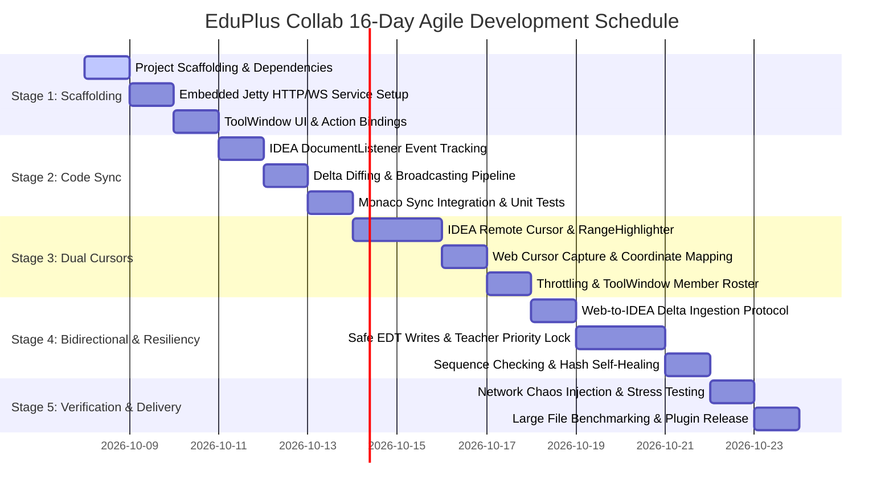

# EduPlus Collab: Teacher-Student Real-Time Collaboration Plugin Delivery Plan

> **Scope**: Engineering Delivery, UI Interaction & Quality Assurance Specification  
> **Target Version**: IntelliJ IDEA 2024.1+ (IC/IU) / Kotlin 2.0.0 / Gradle 8.x  
> **Full Lifecycle**: 16 Business Days (Agile Sprint Delivery)

---

## Table of Contents
1. [Project Scaffolding & Directory Layout](#1-project-scaffolding--directory-layout)
2. [IntelliJ ToolWindow Control Panel Design](#2-intellij-toolwindow-control-panel-design)
3. [5-Stage WBS Task Breakdown (16-Day Schedule)](#3-5-stage-wbs-task-breakdown-16-day-schedule)
4. [Quality Assurance, Test Matrix & Risk Mitigation](#4-quality-assurance-test-matrix--risk-mitigation)
5. [Production-Ready Component Manifest](#5-production-ready-component-manifest)

---

## 1. Project Scaffolding & Directory Layout

### 1.1 Standard Project Directory Skeleton
Following JetBrains official best practices using Gradle + Kotlin DSL, structured with high cohesion, low coupling, and zero circular dependencies:

```text
eduplus-collab-plugin/
├── .gradle/
├── gradle/
│   └── wrapper/
│       ├── gradle-wrapper.jar
│       └── gradle-wrapper.properties
├── build.gradle.kts                   # Plugin build configuration & dependencies
├── settings.gradle.kts                # Project root definition
├── gradle.properties                  # IntelliJ Platform SDK version, JDK 17/21, JVM parameters
├── src/
│   ├── main/
│   │   ├── kotlin/
│   │   │   └── com/eduplus/collab/
│   │   │       ├── model/             # Domain entities and state models
│   │   │       │   ├── TeachingModels.kt      # Connection status, teaching mode, cursor models
│   │   │       │   └── CollabProtocol.kt      # Transport payload DTOs
│   │   │       ├── protocol/          # Protocol encoding/decoding and dispatching
│   │   │       │   └── ProtocolModels.kt      # Strongly-typed JSON message structures
│   │   │       ├── server/            # Embedded server engine
│   │   │       │   ├── EmbeddedJettyServer.kt # Jetty HTTP & WebSocket lifecycle manager
│   │   │       │   ├── CollabWebSocketEndpoint.kt # WebSocket session dispatcher
│   │   │       │   └── CollabProjectService.kt # ProjectService lifecycle integration
│   │   │       ├── service/           # Project-level core business service
│   │   │       │   └── TeachingSessionService.kt # Session management, broadcasting, state sync
│   │   │       ├── editor/            # Editor integration and render layer
│   │   │       │   ├── CollabEditorStartupActivity.kt # Global editor listener auto-attachment
│   │   │       │   └── RemoteApplyGuard.kt    # ThreadLocal + UserData anti-loop guard
│   │   │       ├── render/            # Remote cursor & selection rendering
│   │   │       │   ├── RemoteCursorRenderer.kt # Student cursor line and name tag painter
│   │   │       │   └── RemoteCursorManager.kt  # MarkupModel RangeHighlighter lifecycle
│   │   │       ├── arbitration/       # Teaching conflict resolution
│   │   │       │   └── TeacherPriorityLockManager.kt # Preemption write lock manager
│   │   │       ├── faulttolerance/    # Network resiliency engine
│   │   │       │   ├── NetworkFaultToleranceEngine.kt # Throttling, debouncing, heartbeats
│   │   │       │   └── ReplayBufferManager.kt # Sliding replay buffer & state recovery
│   │   │       └── ui/                # ToolWindow UI components
│   │   │           ├── TeachingToolWindowFactory.kt # ToolWindow factory
│   │   │           ├── TeachingControlPanel.kt      # Master control panel (Swing / JBUI)
│   │   │           ├── action/ToggleCollabAction.kt # Menu bar & shortcut actions
│   │   │           └── component/
│   │   │               ├── StatusIndicatorComponent.kt # Animated status LED
│   │   │               └── CursorLegendCard.kt      # Dual-cursor legend card
│   │   └── resources/
│   │       ├── META-INF/
│   │       │   └── plugin.xml         # Plugin descriptor (extensions, actions, services)
│   │       └── webapp/                # Bundled student web app (Monaco Editor HTML/JS/CSS)
│   │           ├── index.html
│   │           ├── style.css
│   │           └── app.js
│   └── test/
└── docs/                             # Architecture specifications & delivery plans
```

### 1.2 Module Layering & Architectural Contracts

| Package | Core Responsibility | Dependency Constraints | Key Design Principle |
| :--- | :--- | :--- | :--- |
| `model` | State machines, roles, coordinates, payloads | Kotlin Stdlib only | Pure immutable data classes |
| `protocol` | Serialization, deserialization, schema validation | `model`, `gson` | Forward compatibility and strict schema matching |
| `server` | Embedded port binding, WS handshake, pool management | `protocol`, `Jetty 11` | Runs on background daemon thread; never blocks EDT |
| `service` | Central session management, document tracking | `server`, `protocol`, `model` | Project-level singleton implementing `Disposable` |
| `editor` | Mutation capture, cursor rendering, safe writes | `service`, `model`, IDEA Platform | Follows IDEA threading model (`ReadAction` / `WriteCommandAction`) |
| `ui` | ToolWindow panel, status indicators, legends | `service`, `model`, Swing/JBUI | All UI updates executed on `SwingUtilities.invokeLater` |

---

## 2. IntelliJ ToolWindow Control Panel Design

### 2.1 UI Layout & Visual Flow
Docked on the right sidebar (Anchor = Right), auto-resizing width (280px ~ 360px), arranged into 5 functional sections:

```text
+-------------------------------------------------------------+
|  [● Teaching Session Active] (Green/Yellow/Red)   [ Stop ]  |  <- 1. Status & Control
+-------------------------------------------------------------+
|  Student Access URL:                                        |
|  [ http://127.0.0.1:9876/?token=xxx ] [Copy] [Browser]      |  <- 2. Access Sharing
+-------------------------------------------------------------+
|  Teaching Mode:                                             |
|  ( ) Teacher Exclusive Mode     (•) Interactive Mode        |  <- 3. Collaboration Mode
|  Hint: Both teacher and students can type freely.           |
+-------------------------------------------------------------+
|  Dual-Cursor Legend:                                        |
|  [ Teacher ] (Blue #2979FF)  Host pointer, broadcast focus  |  <- 4. Cursor Legend Card
|  [ Student ] (Orange #FF9100) Interactive pointer, live tags|
+-------------------------------------------------------------+
|  Connected Students (3 online):                             |
|  • Alice (Student) [18ms] - Line 42, Col 15                 |  <- 5. Live Member Monitor
|  • Bob   (Student) [24ms] - Line 10, Col 1                  |
|  • Chris (Student) [95ms] - Unfocused                       |
+-------------------------------------------------------------+
```

### 2.2 Component Specifications

1. **Service Toggle Button**:
   - **Idle**: Green (`#388E3C`), labelled "Start Service".
   - **Transitioning**: Disabled with spinner while binding server sockets asynchronously.
   - **Running**: Red (`#D32F2F`), labelled "Stop Service", auto-updating the address field with balloon notifications.
2. **Access URL & One-Click Actions**:
   - Highlighted read-only field: `http://127.0.0.1:{port}/?token=...`.
   - **[Copy]**: Copies URL to system clipboard and displays a 2-second confirmation toast.
   - **[Open in Browser]**: Launches system default browser via `BrowserUtil.browse(url)`.
3. **Four-State Animated Status Indicator**:
   - **Gray (`#8C8C8C`)**: `IDLE` (Service stopped).
   - **Yellow (`#E5A800`)**: `WAITING` (Listening on port, awaiting student connection).
   - **Green (`#388E3C`)**: `CONNECTED` (Active session with connected students).
   - **Flashing Red (`#D32F2F`)**: `NETWORK_SHAKING` (Heartbeat latency exceeding threshold or packet loss).
4. **Dual-Cursor Legend Card**:
   - Styled with rounded capsules adapting to light/dark themes (`JBColor`).
   - Teacher Pointer: High-visibility blue (`#2979FF`).
   - Student Pointer: Warm orange (`#FF9100`) with dynamic student name capsule tags.
5. **Teaching Mode Selector**:
   - **Interactive Mode (Default)**: Two-way editing enabled. Keystrokes are synchronized across teacher and students with non-invasive conflict arbitration.
   - **Teacher Exclusive Mode**: Broadcasts read-only mode (`readOnly: true`) to student Monaco editors.

---

## 3. 5-Stage WBS Task Breakdown (16-Day Schedule)



### 3.1 Stage 1: Scaffolding (Days 1–3)
- **Goal**: Set up the plugin project structure, initialize embedded Jetty server, and construct the ToolWindow control panel.
- **Deliverables**: Compilable Gradle project, ToolWindow UI panel, embedded HTTP/WebSocket test server.
- **Criteria**: `./gradlew runIde` starts successfully; right sidebar displays "EduPlus Collab" ToolWindow; web browser loads base template.

### 3.2 Stage 2: Code Sync Pipeline (Days 4–6)
- **Goal**: Synchronize teacher typing in IntelliJ to student Monaco editors with low latency (<50ms).
- **Deliverables**: Document mutation tracking, incremental diffing protocol, web client Monaco consumer.
- **Criteria**: Typing and pasting 200+ lines in IntelliJ propagates accurately to Monaco without ordering anomalies.

### 3.3 Stage 3: Dual-Cursor Visualization (Days 7–10)
- **Goal**: Render bidirectional cursor positions and selections (Teacher Blue, Student Orange).
- **Deliverables**: `RemoteCursorRenderer`, `RemoteCursorManager`, coordinate translation logic, 30ms throttling.
- **Criteria**: Student mouse selection renders orange highlights in IDEA with student name tag; teacher movements update Monaco smoothly.

### 3.4 Stage 4: Bidirectional Sync & Fault Tolerance (Days 11–14)
- **Goal**: Support student input into IntelliJ in Interactive Mode with anti-echo protection and teacher exclusive locks.
- **Deliverables**: Safe write executor (`WriteCommandAction`), anti-loop guard (`RemoteApplyGuard`), Teacher Priority Lock.
- **Criteria**: Keystrokes are safely merged; teacher exclusive mode instantly locks student editing; sequence anomalies auto-recover.

### 3.5 Stage 5: Verification & Hardening (Days 15–16)
- **Goal**: Pressure testing under network jitter, large files (1000+ lines), and final artifact packaging.
- **Deliverables**: Automated test suite, production plugin ZIP distribution (`eduplus-collab-plugin-1.0.0.zip`).
- **Criteria**: Continuous typing in 1500-line files causes 0 EDT UI freezes (<15ms per operation); memory increase <50MB.

---

## 4. Quality Assurance, Test Matrix & Risk Mitigation

### 4.1 Network Chaos Simulation
- **Profile A (Campus Wi-Fi Congestion)**: 8% packet drop, 80ms latency, 3% retransmission.
- **Profile B (Extreme Jitter)**: 300ms latency, 150ms jitter, 5% out-of-order delivery.
- **Profile C (Temporary Drop)**: 5-second total disconnection followed by recovery.
- **Expected Result**: 3-second heartbeats trigger yellow/red warnings; automatic exponential reconnection resumes session within 1s after network recovery.

### 4.2 Cursor Drift & Code Desynchronization Test Matrix

| ID | Test Scenario | User Action | Potential Failure | Root Cause | Defense & Recovery | Acceptance Criteria |
|:---:|:---|:---|:---|:---|:---|:---|
| **TC-01** | Concurrent typing on same line | Teacher & student type concurrently within 5 chars | Interleaved characters or misplaced cursors | Cursor offset computed before text patch applied | Apply edits before computing caret offsets; use logical line+col coordinates | Content reaches eventual consistency; cursors positioned correctly |
| **TC-02** | Multi-line insertions | Teacher presses Enter 5 times at line 10 | Student cursor at line 25 fails to shift downward | Cursor position stored as absolute row without line tracking | Bind cursor positions to IntelliJ `RangeMarker` with automatic offset shifting | Student cursor shifts smoothly to line 30 |
| **TC-03** | Bulk code paste | Teacher selects 300 lines and pastes new code | High diff overhead causing frame drops | Fine-grained character diff timeouts on massive replacements | Degrade to Full Snapshot sync when changes exceed 100 lines or 40% difference | Web updates via snapshot within 40ms without data loss |
| **TC-04** | Packet loss skipping versions | 3 consecutive diff packets dropped | Client version desynchronized | Missing sequence number chain validation | Attach `seqId` and `version` to each delta; request full sync when sequence gaps occur | Automatically triggers full snapshot resync without fatal errors |
| **TC-05** | Rapid tab switching | Teacher rapidly switches between 3 editor tabs | Student view stays on old file or highlighters cross-render | Tab switch event not broadcasting file context; highlighter leakage | Listen to `FileEditorManagerListener`, clear all highlighters on tab switch, broadcast `code_full` | Web switches cleanly within milliseconds with no blank screen |

### 4.3 Large File (1000+ Lines) Performance Specifications
- **EDT Zero-Block Guarantee**: Diffing and JSON serialization run strictly on background thread pools (`AppExecutorUtil`).
- **Highlighter Reuse**: Avoid repeatedly calling `addRangeHighlighter`; update existing range handles or cleanly dispose upon tab transitions.
- **Performance Targets**:
  - Max text size: 1,500 lines (~50KB).
  - CPU usage increment on host: <8%.
  - Old Gen memory footprint: <30MB.
  - UI freeze duration: 0 alerts from IntelliJ freeze watchdog (<10ms).

---

## 5. Production-Ready Component Manifest

All core components are implemented and available in the repository:
1. `build.gradle.kts`: Gradle Kotlin DSL build script using IntelliJ Platform Plugin 2.x.
2. `src/main/resources/META-INF/plugin.xml`: ToolWindow, actions, services, and extensions.
3. `com.eduplus.collab.model.TeachingModels.kt`: Domain state machine, roles, and modes.
4. `com.eduplus.collab.service.TeachingSessionService.kt`: Central collaboration orchestrator.
5. `com.eduplus.collab.render.RemoteCursorManager.kt`: Safe `MarkupModel` highlighter lifecycle manager.
6. `com.eduplus.collab.editor.RemoteApplyGuard.kt`: ThreadLocal & UserData echo-loop mutex.
7. `com.eduplus.collab.ui.TeachingControlPanel.kt`: ToolWindow control panel UI.
8. `webapp/app.js` & `webapp/style.css`: Monaco Editor client with floating cursor badges.
